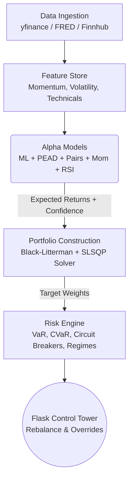

# Hedge Fund Control Tower 

Welcome to your production-ready algorithmic trading Control Tower. This system is designed to transition from theoretical backtesting into a live, institutional-grade decision support platform.

> [!IMPORTANT]
> **This is a Control Tower, not an Autopilot.**
> The system is designed to process millions of data points and mathematically derive optimal portfolio allocations, but **you make the final execution decisions**. 

---

## 1. What Does This System Do?

This platform executes a strict, 14-step sequential "Quant Assembly Line" every trading day. It ensures human emotion is removed from data analysis while retaining human intuition in the final execution phase.

### The Pipeline Architecture



1. **Data Ingestion:** Incremental daily data pipeline pulling split/dividend-adjusted price series from **yfinance, FRED, and Finnhub**.
2. **Feature Store:** Calculates engineered indicators (1M/3M/6M/12M Momentum, Sector Relative Momentum, Volatility, RSI).
3. **Alpha Models:** Combines Momentum, Sector Momentum, RSI Mean Reversion, Volatility Timing, PEAD (Post-Earnings Drift), and XGBoost/LightGBM ML models.
4. **Portfolio Construction:** Uses **Black-Litterman** reverse optimization with Ledoit-Wolf shrinkage covariance. Solves SLSQP optimization under max position ($15\%$), sector ($30\%$), and correlation cluster ($25\%$) caps.
5. **Risk Engine:** Computes VaR/CVaR, tracks macro stress regimes, applies half-Kelly position sizing, and enforces automated circuit breakers ($-15\%$ stock / $-12\%$ ETF).
6. **Control Tower:** Renders recommended trades on the **Flask Terminal** (`http://localhost:5000`) for review and override logging.

---

## 2. Key Web UI Features (`http://localhost:5000`)

- **Overview (`/`):** Real-time NAV, cash, holdings, trade advisor, and state file ages.
- **Briefing (`/briefing`):** Executive LLM-generated narrative summarizing pipeline health, macro context, and trade priorities.
- **Watchlist & Queue (`/watchlist`, `/queue`):** High-conviction monitoring and trade signal staging.
- **Highlighted (`/highlighted`):** Priority stocks flagged by the models for immediate attention.
- **Optimization Lab (`/lab`):** Custom portfolio construction lab to experiment with weights and constraints.
- **Pairs Trading (`/pairs`):** Statistical arbitrage pairs scanning, correlation matrices, and spread analysis.
- **BT History (`/backtest/history`):** Complete backtest run browser, date range filter, side-by-side metric comparison with winner highlights, equity curve overlay chart (normalised to 100%), alpha IC viewer, and inline note editor.
- **Rebalance (`/rebalance`):** Weight deltas, trade sizing in EUR, override logger, and trade execution controls.
- **Risk & Strategy (`/risk`):** Monte Carlo VaR/CVaR, price targets, 1-sigma stop losses, and regime gauges.
- **ML Research (`/research`):** Rolling Information Coefficient (IC) metrics, model decay alerts, and walk-forward reports.
- **ETF Divergence (`/divergence`):** Human-in-the-loop scenario labeling interface for ETF-stock divergence signals.
- **Laggard Screen (`/laggards`):** Sector rotation laggards with disqualifier checks and conviction ratings.
- **Settings & Tax (`/settings`, `/legal`):** Jurisdiction-aware tax settings for execution optimization.

---

## 3. Backtesting Suite & Run Registry (`backtests/`)

Runs walk-forward backtests without polluting the live database. Each run produces **immutable, dated artifacts**:

```
backtests/runs/
  20260820_152600/
    backtest_results.csv     ← daily equity curve & benchmark
    backtest_metrics.csv      ← Sharpe, CAGR, MDD, Alpha, Beta, etc.
    alpha_ic_results.csv      ← IC, ICIR, hit rate per model
    strategy_config.json      ← complete snapshot of active parameters
    run_meta.json             ← git commit, execution time, notes
  runs_index.csv              ← central master index
```

---

## 4. Quick Start Guide

### 1. Setup Environment
Create a `.env` file at the root:
```env
FRED_API_KEY=your_key
FINNHUB_API_KEY=your_key
DASHBOARD_SECRET=your_secret_token
```

### 2. Run the Full Daily Pipeline
```bash
RUN_FUND_TOTAL.bat
```

### 3. Run the Backtest Suite
```bash
RUN_BACKTEST.bat
# Or pass a custom note:
RUN_BACKTEST.bat "testing tight turnover penalty"
```

### 4. Launch the Web Dashboard
```bash
DASHBOARD_ONLY.bat
# Or for paper-trading sandbox mode:
DASHBOARD_SANDBOX.bat
```
*Open `http://localhost:5000` in your browser.*

---

## 5. System Documentation

For full architectural blueprints, mathematical derivations, and risk engine details, refer to:
- [`docs/trading_system_architecture.md`](file:///c:/Users/ahmty/Desktop/hedge-fund/docs/trading_system_architecture.md) — System architecture & pipeline manual.
- [`docs/trading_system_deep_dive.md`](file:///c:/Users/ahmty/Desktop/hedge-fund/docs/trading_system_deep_dive.md) — Mathematical reference (Black-Litterman, Ledoit-Wolf, Kelly sizing, VaR/CVaR).
- [`docs/quant_portfolio_framework-research.md`](file:///c:/Users/ahmty/Desktop/hedge-fund/docs/quant_portfolio_framework-research.md) — Research notes on the 3 core pillars.
