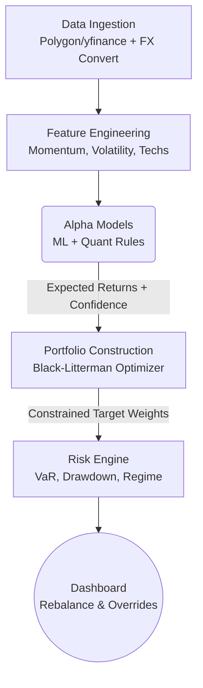

# Hedge Fund Control Tower 

Welcome to your production-ready algorithmic trading Control Tower. This system is designed to transition from theoretical backtesting into a live, institutional-grade decision support platform.

> [!IMPORTANT]
> **This is a Control Tower, not an Autopilot.**
> The system is designed to process millions of data points and mathematically derive the optimal portfolio allocations, but **you make the final execution decisions**. 

---

## 1. What Does This System Do?

This platform executes a strict, sequential "Quant Assembly Line" every trading day. It ensures that human emotion is removed from the data analysis phase, while retaining human intuition in the final execution phase.

### The Pipeline Architecture



1. **Data Ingestion:** Safely pulls split/dividend-adjusted price data, handling FX rates automatically.
2. **Feature Engineering:** Calculates indicators like Momentum, Volatility, and RSI.
3. **Alpha Models:** Multiple independent models (including your ML models and PEAD engine) generate predictions.
4. **Portfolio Construction:** Uses the **Black-Litterman** framework. It blends market equilibrium returns with your models' predictions to find stable, optimal portfolio weights.
5. **Risk Engine:** Subjects the portfolio to stress tests (e.g., 2008 Crash, 2020 COVID) and tracks probabilistic regimes. 
6. **Execution / Control Tower:** Displays the final suggestions on the Streamlit dashboard for you to review, approve, or override.

---

## 2. Is This Useful? (The Value Proposition)

Retail traders lose money because they optimize for raw returns without understanding risk, correlation, and transaction costs. This system is useful because it enforces **institutional constraints**:

* **It prevents error amplification:** Standard Markowitz optimizers can confidently tell you to put 90% of your portfolio in one asset if it has a slightly higher historical return. The Black-Litterman framework prevents these absurd edge cases.
* **It incorporates slippage:** The optimizer models a 0.05% bid-ask spread and turnover penalties. If an asset is suggested as a `BUY`, it's because the expected edge mathematically outweighs the cost to trade it.
* **It catches silent risk:** The Risk Engine tracks VaR (Value at Risk) and CVaR (Expected Shortfall). If the market enters a high-stress regime, the dashboard will warn you before you blindly execute aggressive trades.

---

## 3. How to Know if the ML is Performing Well & Trustworthy

Machine Learning models are notoriously difficult to trust in finance due to overfitting. This system is designed to **defend the portfolio against its own ML models**. 

Here is how you monitor ML health, and how the system mathematically protects you:

### Metric 1: The Information Coefficient (IC)
The system calculates the **Rolling IC** for every model. IC is the correlation between what the ML model predicted today and what the stock actually did tomorrow.
- **IC < 0.05**: Random noise. The model has no edge.
- **IC 0.05 - 0.08**: Solid performance.
- **IC > 0.10**: Exceptional performance.

> [!TIP]
> **Check the Dashboard:** Go to the "Model Health" page on your dashboard to view the rolling 21-day, 63-day, and 252-day IC for your ML models. If the 63-day IC starts trending negative, the market regime has shifted and the model needs retraining.

### Metric 2: Live-Approval Gates & Minimum AUC
Your ML model evaluates probability (AUC - Area Under the Curve). 
* **The Minimum AUC Gate:** If the ML model outputs an AUC of less than `0.53` for an asset, it means the model is effectively guessing a coin flip. The system automatically ignores the signal for that asset.
* **Live-Approval Check:** A model must sustain an IC `> 0.05` for 21 consecutive trading days before it is allowed to heavily influence the portfolio weights.

### The Ultimate Safety Net: Bayesian Confidence Scaling
The Black-Litterman model requires two inputs from the ML model: an **Expected Return** and an **Uncertainty Scalar (Omega)**.
The system dynamically scales Omega based on the ML model's recent IC:
* If the ML model has a **high IC** (it's been highly accurate lately), Omega is lowered. The optimizer trusts the ML and aggressively alters your portfolio weights.
* If the ML model has a **low IC** (it's currently failing), Omega skyrockets. The optimizer effectively ignores the ML model and defaults back to safe, standard market-cap weights.

> [!CAUTION]
> **The ML must earn its allocation.** It cannot blow up your portfolio because its influence is mathematically throttled by its own historical accuracy.

### The Feedback Loop (Man vs. Machine)
On the `Rebalance Suggestions` dashboard, you have the option to **Log an Override**.
If the ML says "BUY AAPL" but you disagree because of macroeconomic news, you log a skip/override. 
Over time, the database tracks your overrides vs. the ML's suggestions and records the 30-day outcome. After 6 months, you will have empirical proof of whether your intuition beats the machine, or if you should trust the machine more often.

---

## Getting Started

1. **Run the Master Pipeline:**
   Execute the batch script to run data ingestion, machine learning research, and optimization.
   ```bash
   RUN_FUND_TOTAL.bat
   ```

2. **Launch the Control Tower Dashboard:**
   The dashboard has been upgraded to a high-performance Flask application.
   ```bash
   DASHBOARD_ONLY.bat
   # OR
   python flask_app.py
   ```
   *Open `http://localhost:5000` in your browser. Navigate to the **Rebalance** tab to view today's mathematically verified targets.*
