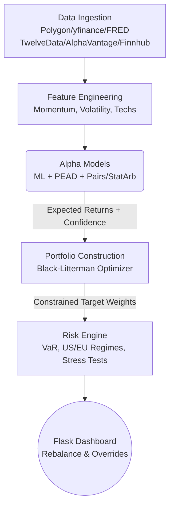

# Hedge Fund Control Tower 

Welcome to your production-ready algorithmic trading Control Tower. This system is designed to transition from theoretical backtesting into a live, institutional-grade decision support platform.

> [!IMPORTANT]
> **This is a Control Tower, not an Autopilot.**
> The system is designed to process millions of data points and mathematically derive the optimal portfolio allocations, but **you make the final execution decisions**. 

---

## 1. What Does This System Do?

This platform executes a strict, sequential "Quant Assembly Line" every trading day. It ensures that human emotion is removed from the data analysis phase, while retaining human intuition in the final execution phase.

### The Pipeline Architecture



1. **Data Ingestion:** Multi-tier fallback pipeline pulling data from **yfinance, FRED, TwelveData, AlphaVantage, and Finnhub**. Handles FX conversion and split-adjustments automatically.
2. **Feature Engineering:** Calculates 50+ technical and fundamental indicators (Momentum, Volatility, RSI, etc.).
3. **Alpha Models:** 
    * **ML Stack:** XGBoost and LSTM models predicting 21-day returns.
    * **PEAD Engine:** Post-Earnings Announcement Drift screener.
    * **Pairs / Stat Arb:** Cointegration-based mean reversion scanner.
    * **ETF Divergence:** Tracks internal asset flows vs index price action.
4. **Portfolio Construction:** Uses the **Black-Litterman** framework. It blends market equilibrium returns with model predictions to find stable, optimal weights.
5. **Risk Engine:** Subjects the portfolio to stress tests and tracks probabilistic **US and EU Macro Regimes** (Risk-On/Off, Growth Cycle, Rate Environment). 
6. **Execution / Control Tower:** Displays final suggestions on the **Flask Terminal** for you to review, approve, or override.

---

## 2. Is This Useful? (The Value Proposition)

Retail traders lose money because they optimize for raw returns without understanding risk, correlation, and transaction costs. This system is useful because it enforces **institutional constraints**:

* **It prevents error amplification:** Standard Markowitz optimizers can confidently tell you to put 90% of your portfolio in one asset if it has a slightly higher historical return. The Black-Litterman framework prevents these absurd edge cases.
* **It incorporates slippage:** The optimizer models bid-ask spreads and turnover penalties. If an asset is suggested as a `BUY`, it's because the expected edge mathematically outweighs the cost to trade it.
* **It catches silent risk:** The Risk Engine tracks VaR (Value at Risk) and CVaR (Expected Shortfall). If the market enters a high-stress regime, the dashboard will warn you before you execute.

---

## 3. How to Know if the ML is Performing Well & Trustworthy

Machine Learning models are notoriously difficult to trust in finance due to overfitting. This system is designed to **defend the portfolio against its own ML models**. 

Here is how you monitor ML health:

### Metric 1: The Information Coefficient (IC)
The system calculates the **Rolling IC** (correlation between prediction and actual outcome).
- **IC < 0.05**: Random noise. The model has no edge.
- **IC 0.05 - 0.08**: Solid performance.
- **IC > 0.10**: Exceptional performance.

> [!TIP]
> **Check the Dashboard:** Navigate to the **ML Research** tab to view rolling IC metrics. If the 63-day IC trends negative, the market regime has likely shifted.

### Metric 2: Live-Approval Gates & Bayesian Scaling
* **AUC Gate:** If the model's AUC (Area Under the Curve) is `< 0.53`, the signal is ignored.
* **Bayesian Scaling:** The Black-Litterman model uses an **Uncertainty Scalar (Omega)**. If a model's recent IC is low, Omega skyrockets, and the optimizer effectively ignores the ML, defaulting to safe market-cap weights.

---

## Getting Started

1. **Setup Environment:**
   Create a `.env` file at the root with your API keys:
   ```env
   FRED_API_KEY=your_key
   TWELVEDATA_API_KEY=your_key
   ALPHAVANTAGE_API_KEY=your_key
   FINNHUB_API_KEY=your_key
   ```

2. **Run the Master Pipeline:**
   Executes data ingestion, macro classification, ML research, and portfolio optimization.
   ```bash
   RUN_FUND_TOTAL.bat
   ```

3. **Launch the Control Tower Dashboard:**
   The dashboard is a high-performance Flask application.
   ```bash
   DASHBOARD_ONLY.bat
   # OR
   python flask_app.py
   ```
   *Open `http://localhost:5000` in your browser. Navigate to the **Rebalance** tab to view today's target allocations.*
