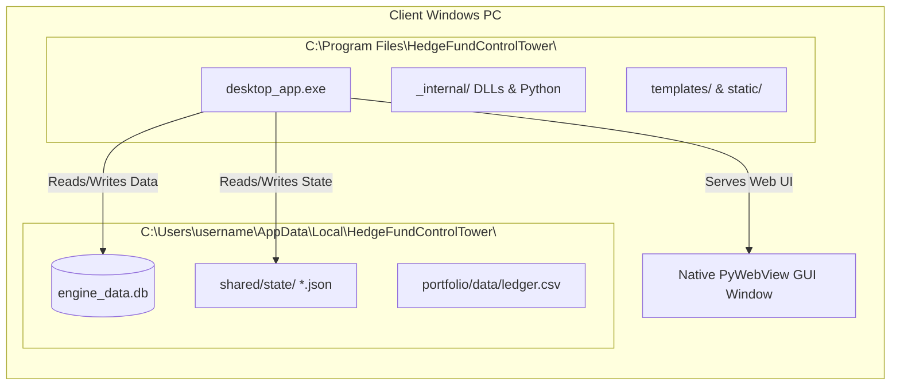

# Client Desktop App Packaging Guide: Hedge Fund Control Tower

To distribute your Python Flask dashboard to non-technical clients as an easy-to-install, professional Windows executable (`Setup.exe`), you need to transition from a developer environment (batch scripts and terminal windows) to a packaged desktop architecture.

This guide details the **Industry Best Practice** workflow, the critical architectural traps to avoid, and provides the exact code templates needed to build a polished desktop application.

---

## 1. Architectural Best Practice & The `--onefile` Trap

When packaging Python applications for Windows clients, developers typically use **PyInstaller**. However, packaging a database-driven Flask app requires strict separation of **Application Binaries** and **Mutable User Data**.



### ❌ The PyInstaller `--onefile` Trap (CRITICAL WARNING)
Do **not** use `pyinstaller --onefile` for your application. 
* **Why:** When a user double-clicks a `--onefile` executable, PyInstaller silently uncompresses the entire application (including any bundled SQLite database and JSON state files) into a temporary system folder (`C:\Users\username\AppData\Local\Temp\_MEIxxxx`). 
* **The Fatal Flaw:** The Flask app will run and write all client trades, custom weights, and overrides to the database inside that temporary folder. When the app is closed, Windows or PyInstaller deletes or abandons the `_MEIxxxx` folder. **Every time the client reopens the app, their entire data and trade history will be permanently wiped.**

### ✅ The Best Practice: `--onedir` + Inno Setup + AppData Separation
1. **PyInstaller `--onedir` (One Directory):** Freeze your Python code, libraries (pandas, numpy, yfinance), and templates into a static, read-only directory.
2. **User AppData Directory for Mutable State:** Configure the app to look for `engine_data.db`, `ledger.csv`, and `shared/state/` inside `C:\Users\<username>\AppData\Local\HedgeFundControlTower` (or the user's `Documents` folder).
3. **Inno Setup Installer Wizard:** Wrap the PyInstaller output directory and initial base database into a standard Windows setup wizard (`HedgeFundControlTower_Setup_v1.0.exe`). The installer puts the program in `C:\Program Files`, seeds the initial database into `AppData`, and creates a Desktop shortcut with a custom icon.

---

## 2. Desktop UI Wrapper: Eliminating the Command Prompt

Clients expect a standalone desktop window, not a black command prompt that launches their web browser. 

We achieve this using **PyWebView**. PyWebView embeds a native Windows Chromium edge window (WebView2) directly into a standalone desktop window while running your Flask server in a background background thread. When the client closes the window, the Flask server automatically shuts down cleanly.

### Step-by-Step Implementation

### A. Install Packaging Dependencies
Run the following in your project environment:
```bash
pip install pyinstaller pywebview pystray
```

### B. Create the Desktop Wrapper (`desktop_app.py`)
Create a new file named `desktop_app.py` in your project root. This file acts as the master entry point for the desktop executable.

```python
# desktop_app.py
import os
import sys
import shutil
import threading
import socket
from pathlib import Path
import webview

# 1. Ensure Mutable Data is stored in the User's AppData directory
APP_NAME = "HedgeFundControlTower"
APPDATA_DIR = Path(os.getenv("LOCALAPPDATA", Path.home())) / APP_NAME

# Define mutable data paths in AppData
DB_PATH = APPDATA_DIR / "engine_data.db"
STATE_DIR = APPDATA_DIR / "shared" / "state"
LEDGER_PATH = APPDATA_DIR / "portfolio" / "data" / "ledger.csv"

def initialize_user_data():
    """Seeds the user's AppData folder with initial database and state files if they don't exist."""
    APPDATA_DIR.mkdir(parents=True, exist_ok=True)
    STATE_DIR.mkdir(parents=True, exist_ok=True)
    LEDGER_PATH.parent.mkdir(parents=True, exist_ok=True)
    
    # Determine where the bundled/installed base files are
    bundle_dir = Path(getattr(sys, '_MEIPASS', os.path.abspath(os.path.dirname(__file__))))
    
    # Seed SQLite DB
    base_db = bundle_dir / "engine_data.db"
    if not DB_PATH.exists() and base_db.exists():
        shutil.copy2(base_db, DB_PATH)
        
    # Seed State JSONs
    base_state = bundle_dir / "shared" / "state"
    if base_state.exists():
        for file in base_state.glob("*.*"):
            target_file = STATE_DIR / file.name
            if not target_file.exists():
                shutil.copy2(file, target_file)

# Initialize data before importing Flask app
initialize_user_data()

# 2. Set Environment Variables for Flask App Overrides
os.environ["DATABASE_URL"] = f"sqlite:///{DB_PATH}"
os.environ["CONTROL_TOWER_STATE_DIR"] = str(STATE_DIR)
os.environ["CONTROL_TOWER_LEDGER_PATH"] = str(LEDGER_PATH)
os.environ["FLASK_ENV"] = "production"
os.environ["DASHBOARD_ONLY"] = "1"  # Disable background scheduler if client is view-only

# 3. Import Flask App
# (Add project root to path to ensure internal imports work correctly)
sys.path.insert(0, str(Path(__file__).parent.resolve()))
from flask_app import app

def find_free_port():
    s = socket.socket(socket.AF_INET, socket.SOCK_STREAM)
    s.bind(('localhost', 0))
    port = s.getsockname()[1]
    s.close()
    return port

def run_flask(port):
    # Run Flask server with Werkzeug or Waitress in production mode
    app.run(host='localhost', port=port, debug=False, use_reloader=False)

if __name__ == "__main__":
    port = find_free_port()
    
    # Start Flask in a daemon thread so it dies when the GUI window closes
    flask_thread = threading.Thread(target=run_flask, args=(port,), daemon=True)
    flask_thread.start()
    
    # Create and start the native desktop window
    webview.create_window(
        title="Hedge Fund Control Tower",
        url=f"http://localhost:{port}",
        width=1400,
        height=900,
        min_size=(1024, 768),
        background_color="#0b0f19" # Match your dark UI theme
    )
    webview.start()
```

---

## 3. Minor Codebase Adaptations for Environment Overrides

To ensure `flask_app.py` and `shared/state_paths.py` respect the new AppData paths set by `desktop_app.py`, make the following two small adjustments in your codebase:

### A. `shared/state_paths.py`
Update `STATE_DIR` to check for the environment variable:

```python
# shared/state_paths.py
import os

_HERE = os.path.dirname(os.path.abspath(__file__))
PROJECT_ROOT = os.path.normpath(os.path.join(_HERE, ".."))

# CHECK FOR ENVIRONMENT VARIABLE OVERRIDE FIRST
STATE_DIR = os.getenv("CONTROL_TOWER_STATE_DIR", os.path.join(PROJECT_ROOT, "shared", "state"))
```

### B. `flask_app.py`
Update `_append_to_ledger_csv` to check for the environment variable:

```python
# flask_app.py
def _append_to_ledger_csv(trade_date, action, ticker, qty, price, total, notes):
    try:
        # CHECK FOR ENVIRONMENT VARIABLE OVERRIDE FIRST
        env_ledger = os.getenv("CONTROL_TOWER_LEDGER_PATH")
        if env_ledger:
            ledger_path = Path(env_ledger)
        else:
            ledger_path = ROOT / "portfolio" / "data" / "ledger.csv"
            
        ledger_path.parent.mkdir(parents=True, exist_ok=True)
        # ... rest of function remains identical
```
*(Note: `engine/db/db.py` already checks `os.getenv('DATABASE_URL')`, so it requires zero changes!)*

---

## 4. Freezing the Application with PyInstaller

Create a PyInstaller specification file named `control_tower.spec` in your project root. This tells PyInstaller exactly which templates, static files, and base databases to bundle into the application directory.

```python
# control_tower.spec
# -*- mode: python ; coding: utf-8 -*-

block_cipher = None

# Include necessary data folders (templates, static, base DB, base state)
datas = [
    ('templates', 'templates'),
    ('engine_data.db', '.'),
    ('shared/state', 'shared/state'),
]

a = Analysis(
    ['desktop_app.py'],
    pathex=[],
    binaries=[],
    datas=datas,
    hiddenimports=[
        'scipy.special.cython_special',
        'yfinance',
        'sqlite3',
        'sqlalchemy',
        'webview',
        'flask',
        'engine',
        'portfolio',
        'shared',
    ],
    hookspath=[],
    hooksconfig={},
    runtime_hooks=[],
    excludes=[],
    win_no [..truncated..]
