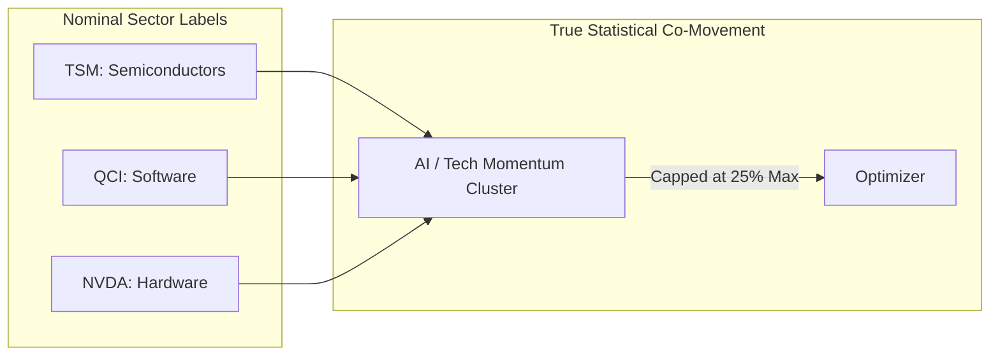

# 🚀 Quant Frontier: Advanced Strategic Improvements
**Transitioning from a Retail Pipeline to an Institutional-Grade Control Tower.**

This document outlines the high-alpha technical upgrades required to move the fund into a professional production environment. These improvements focus on **trust**, **robustness**, and **mathematical edge**.

---

1. The "Daily Heartbeat" (Observability)
Problem: You don't know if the system ran successfully without logging in.
Brainstorm: Create a digest.py module that sends a daily summary (Email or Slack Webhook) at 17:30 CET.
Content:
"✅ Pipeline Success" or "❌ Pipeline FAILED at Step 4".
Top 3 Trade Suggestions (Delta Weights).
Current Portfolio Value & daily P&L.


### 1. Model Explainability Layer (SHAP/LIME)
*Transforming the "Black Box" into a "Glass Box".*

**The Opportunity:** As the human in the "Control Tower," you need to know *why* the model made a decision before you approve an override.
*   **The Implementation:** Integrate **SHAP (SHapley Additive exPlanations)** values directly into the Flask dashboard.
*   **The Visual:** When the system suggests a `BUY` on **AAPL**, the UI should display a waterfall chart showing the top 3 drivers (e.g., *"Driven 40% by Volatility Compression, 30% by Momentum, -10% by RSI"*).
*   **The Goal:** Move manual overrides from "gut feeling" to informed, data-driven decisions.

### 2. Robust Portfolio Construction (Ledoit-Wolf Shrinkage)
*Eliminating mathematical noise in the Covariance Matrix.*

> [!CAUTION]
> **The Trap:** Standard historical covariance matrices are prone to "eigenvalue spreading," where noise is mistaken for signal. This leads to unstable, extreme weights and potential portfolio blowups.

*   **The Solution:** Apply **Ledoit-Wolf Shrinkage** to the covariance matrix. This pulls noisy, extreme correlations toward the average, making the Black-Litterman optimizer significantly more robust in out-of-sample data.
*   **Outcome:** Smoother rebalancing suggestions and reduced "twitchiness" in the portfolio weights.

### 3. Factor Exposure Intelligence (Fama-French)
*Detecting and managing "Silent" factor concentration.*

**The Risk:** Your ML models might accidentally rediscover the "Momentum" or "High Beta" factors. If the market regime shifts (e.g., Growth to Value), the entire portfolio could fail simultaneously.
*   **The Implementation:** Add a rolling **Factor Exposure** breakdown (Beta, Size, Value, Momentum) to the Risk Engine.
*   **The Dashboard:** Before approving a trade, the UI must warn: *"This rebalance will increase Portfolio Beta to 1.2 and tilt heavily toward Small-Cap Growth."*
*   **Goal:** Ensure Alpha is generated by skill, not by an unintended macro bet.

### 4. Liquidity-Aware Execution Modeling (ADV-Based)
*Making transaction costs non-linear and realistic.*

**The Opportunity:** A static 0.05% slippage model is unrealistic for mid-cap stocks or high-volatility regimes.
*   **The Solution:** Tie the transaction cost penalty in the optimizer to the **Average Daily Volume (ADV)** and intraday volatility.
*   **The Rule:** If the ML wants to buy an illiquid asset, the optimizer should demand a "Liquidity Premium" (higher expected return) to justify the entry/exit costs.
*   **Outcome:** Prevents the system from "chasing" theoretical gains that disappear in the bid-ask spread.

### 5. "Man vs. Machine" Analytical Feedback Loop
*The scientific evolution of human intuition.*

**The Practice:** Your override log is the key to your growth as a manager.
*   **The Database:** Ensure the `override_log` captures the full **Market Context** at the moment of the decision.
*   **Contextual Data:** Log the **VIX**, the **Model's IC**, specific **ML features**, and the **Categorical Reason** (e.g., *"Macro Event," "Technical Resistance"*).
*   **The Payoff:** In 6 months, you can run a statistical audit to identify the exact market conditions where your intuition adds value versus where you should have trusted the machine.

---

## 🛠️ Phase 2: Future Roadmap (Advanced Gaps)

> [!TIP]
> **Survivorship Bias Guardrails:** Implement a Point-in-Time universe handler to ensure the model isn't trained on "winners only," which artificially inflates backtest performance.

> [!IMPORTANT]
> **Execution Drift Reconciliation:** Add a "Reconciliation Step" where the system compares your **Actual Portfolio** to the **Target Portfolio**. If "Drift" exceeds 0.5%, the system should trigger a high-priority rebalance alert.

> [!NOTE]
> **Regime-Specific Ensembles:** Move toward a "Multi-Model" approach where different models (Momentum vs. Mean-Reversion) are dynamically weighted based on the current market volatility regime.

---

## 🏗️ Phase 3: Operational Excellence & Risk Safeguards
*Practical, "No-Sci-Fi" measures to protect capital and reduce waste.*

### 1. Tolerance Band Rebalancing (Efficiency)
*   **The Problem:** Over-trading for tiny 0.1% gains that are eaten by broker commissions.
*   **The Solution:** Implement **Tolerance Bands**. Only execute a rebalance trade if an asset's weight "drifts" from the target by more than a set threshold (e.g., **±0.75%**).
*   **Benefit:** Reduces portfolio "churn," saves on fees, and avoids noise-driven trading.

### 2. Hard Stop-Loss "Circuit Breakers" (Safety)
*   **The Problem:** ML models can be slow to react to "Black Swan" events or corporate scandals.
*   **The Solution:** Set absolute **hard floors** for every position (e.g., **-15% from entry**). If a stock hits this floor, the system triggers an emergency exit signal that overrides any "Hold" or "Buy" recommendation.
*   **Benefit:** Provides a non-mathematical safety net for when the world changes faster than the data.

### 3. Benchmarking & Active Share Tracking (Accountability)
*   **The Problem:** "Closet Indexing"—taking fees/risk while just tracking the S&P 500.
*   **The Solution:** Plot the fund's equity curve against a primary benchmark (**SPY** or **QQQ**). Calculate **Active Share** to ensure the portfolio is sufficiently unique to justify the strategy.
*   **Benefit:** Keeps you honest about whether your Alpha is real or just Beta in disguise.

### 4. Multi-Source Data Validation (Redundancy)
*   **The Problem:** Relying solely on `yfinance` creates a single point of failure and risk of "Bad Ticks."
*   **The Solution:** Use secondary APIs as a **Sanity Check** for closing prices. If the primary and secondary sources disagree by >1%, the pipeline pauses for review.
*   **Backup Infrastructure:**
    *   **Twelve Data (Primary Backup):** `4ac48ac6588d473ca2151c4eadb8022b` (800 req/day)
    *   **Alpha Vantage (Deep Backup):** `75JQ8RG89HGRI5Z4` (25 req/day)
    *   **Finnhub (Specialized):** `d82nd81r01qmgc0gq7c0d82nd81r01qmgc0gq7cg`

### 5. Systematic Tax-Loss Harvesting (Return Enhancement)
*   **The Problem:** Tax drag can reduce annual returns by 1-2%.
*   **The Solution:** When two assets have similar ML Alpha scores, the system should prioritize selling the one with an unrealized loss to capture the tax benefit ("Tax Alpha").
*   **Benefit:** Generates extra return through smart liability management, regardless of market direction.

---

## 🏛️ Phase 4: Institutional Governance & Risk Hygiene
*The "Golden Rules" used by professionals to prevent catastrophic failures.*

### 1. Hard Concentration Caps (The 15/30 Rule)
*   **The Best Practice:** Even with a high-conviction ML signal, risk must be diversified to prevent "Idiosyncratic Blowups."
*   **The Rule:** No single asset shall exceed **15%** of the total portfolio value, and no single industry sector (e.g., Technology, Financials) shall exceed **30%**.
*   **Benefit:** Protects the fund from being destroyed by a single bad CEO or one sector-specific regulatory shock.

### 2. "Days-to-Liquidate" Constraints
*   **The Best Practice:** Ensure the portfolio remains "fluid." You must be able to exit a position without "crashing" the price of the stock yourself.
*   **The Rule:** A position size should ideally be liquidatable within **2 trading days** while representing no more than 5% of the Average Daily Volume (ADV).
*   **Benefit:** Ensures that in a market crisis, you can actually exit your positions at a fair price.

### 3. Strategic Retraining Windows (Tuesday & Saturday)
*   **The Best Practice:** Avoid daily retraining to prevent "overfitting" to market noise. Stability in the model is key.
*   **The Schedule:** Retrain models exactly **twice per week**:
    1.  **Saturday Morning:** To digest the full previous week's data and prepare for Monday's open.
    2.  **Tuesday Evening:** To adjust for any "Monday momentum" and mid-week regime shifts.
*   **Benefit:** Reduces turnover and ensures the ML model has a large enough sample size of new data before changing its "opinion."

### 4. Isolated Sandbox Paper Trading Gate
*   **The Practice:** Never test new code in the production environment.
*   **The Implementation:** Create a **complete clone (Sandbox Instance)** of the Control Tower. New algorithms and model versions must run in this isolated sandbox for **21 trading days** using live data but "Paper" execution.
*   **Benefit:** Completely decouples your "Experimentation" from your "Capital." It proves the code is bug-free and the Alpha is real before a single dollar is risked.

### 5. Sharpe Ratio Haircuts (The Realism Check)
*   **The Best Practice:** Backtests are inherently "perfect." Real trading is messy.
*   **The Rule:** Take your backtested Sharpe Ratio and apply a **50% "Haircut."** If the strategy still makes sense with half the expected return, it is robust enough to trade.
*   **Benefit:** Prevents the psychological trap of "Backtest Euphoria" and ensures you are prepared for realistic, lower-than-expected returns.


Edited how-desktop.md
Edited flask_app.py
Edited state_paths.py
Edited improvements.md
Viewed improvements.md:152-181
Viewed improvements.md:1-135
Viewed improvements.md:135-135

Here is the professionally expanded, institutional-grade documentation for your 6 strategic improvements. It is fully formatted in GitHub markdown, matching the exact style of your existing `improvements.md` document so you can copy and paste it directly.

```markdown
### 1. Tax-Aware Selling Optimization (Abgeltungsteuer)
*Preserving compounding capital by penalizing frictional tax drag.*

> [!IMPORTANT]  
> **The Context:** Germany enforces a flat capital gains tax (*Abgeltungsteuer*) of approximately 26.375% (including solidarity surcharge). Unlike jurisdictions with long-term capital gains exemptions, German tax liability attaches immediately upon realization, permanently reducing your compounding capital base.

*   **The Problem:** Standard Mean-Variance and Black-Litterman rebalancing algorithms routinely suggest trimming winning positions to reallocate capital to assets with marginally higher Alpha scores. Doing so triggers an immediate 26.375% tax drag on the realized profit, creating a severe cash friction that degrades long-term net returns.
*   **The Implementation (`optimizer.py`):** Introduce a `tax_penalty` vector directly into the optimization objective function. When evaluating a potential sell order, the optimizer calculates the estimated tax liability: `(current_price - cost_basis) * 0.26375`. This frictional drag is subtracted from the expected return of the replacement asset.
*   **The Benefit (Tax Alpha):** The optimizer establishes a dynamic hurdle rate. It will naturally let winning positions run longer (deferring tax realization) unless the replacement asset's expected Alpha is large enough to overcome the 26.375% tax friction.

---

### 2. Benchmark Equity Curve Overlay & Active Share Tracking
*Defending the fund mandate through absolute mathematical transparency.*

> [!WARNING]  
> **The Trap:** "Closet Indexing"—charging active management or performance fees while maintaining a portfolio structure that essentially mimics the broader market index. Without direct visual and quantitative benchmarking, allocators cannot verify if returns are true Alpha or disguised Beta.

*   **The Implementation (`analytics.html` & `performance_history`):** 
    1. **Visual Overlay:** Plot the fund's live equity curve directly against primary institutional benchmarks: **SPY** (S&P 500) and **EUNL.DE** (iShares Core MSCI World UCITS ETF for European dual-currency context).
    2. **Active Share Calculation:** Continuously calculate and display the portfolio's Active Share: $$\text{Active Share} = \frac{1}{2} \sum |w_{\text{fund}} - w_{\text{benchmark}}|$$
*   **The Benefit:** Institutional accountability. Proves conclusively to clients and stakeholders that the fund is generating genuine, uncorrelated Alpha rather than riding market Beta.

---

### 3. Hard Stop-Loss "Circuit Breakers"
*An absolute, non-negotiable safety net for catastrophic structural breaks.*

> [!CAUTION]  
> **The Risk:** Machine learning models reliant on rolling historical windows or lagging technical indicators can be dangerously slow to react to black swan events, corporate accounting fraud, or overnight geopolitical crises.

*   **The Implementation (`pre_trade.py` & `risk_events`):** Build a deterministic, rule-based execution layer that executes before any optimizer or model order is routed. The system monitors the absolute drawdown of every holding from its execution cost basis.
*   **The Rule:** If an asset breaches a strict absolute floor (e.g., **-15.0% from entry**), the Circuit Breaker instantly overrides any ML `Hold` or `Buy` signal, generates an immediate market liquidation order, and logs a high-severity alert to the `risk_events` table.
*   **The Benefit:** Eliminates single-stock wipeout risk. Provides a robust mathematical circuit breaker that protects client capital when real-world events move faster than historical training data.

---

### 4. Signal Explainability Layer (SHAP Attribution)
*Transforming the AI "Black Box" into an institutional "Glass Box."*

> [!TIP]  
> **The Opportunity:** As the human pilot in the Control Tower, you cannot confidently approve or override a major model rebalance (e.g., shifting 10% into a volatile tech asset) without understanding the underlying economic drivers.

*   **The Implementation (`model_outputs` table & `rebalance.html`):** Integrate **SHAP (SHapley Additive exPlanations)** values into the inference pipeline. When the model writes target weights to `model_outputs`, it attaches feature attribution arrays.
*   **The Dashboard Visual:** On `rebalance.html`, clicking any suggested trade expands an interactive waterfall chart displaying the exact percentage breakdown of the recommendation (e.g., *"BUY suggestion driven 40% by Volatility Compression, 30% by Momentum, -10% by RSI Overbought"*).
*   **The Benefit:** Empowers the portfolio manager to ground manual override decisions in verifiable data science rather than gut intuition.

---

### 5. Override Outcome Tracking & Attribution
*The scientific evolution and auditing of human intuition.*

> [!NOTE]  
> **The Problem:** Portfolio managers frequently override quantitative models based on discretionary news or intuition. However, human memory suffers from confirmation bias—managers vividly remember their successful overrides while forgetting the times their intervention degraded returns.

*   **The Implementation (`override_log` & `scheduler.py`):** The `override_log` table already contains `outcome_30d` and `outcome_90d` columns, but they remain unpopulated. Wire an automated background task in `scheduler.py` that executes every weekend to backfill these columns.
*   **The Calculation:** The job computes the forward 30-day and 90-day P&L difference between the *Manager's Override Choice* and the *Model's Original Suggestion*.
*   **The Benefit:** Ultimate manager accountability. Within 6 months, a statistical audit will reveal the exact market regimes where human intervention generates positive Alpha versus where the machine should have been trusted.

---

### 6. Correlation Cluster Constraints (k-Means)
*Preventing hidden cross-sector factor blowups.*



*   **The Problem:** Traditional sector concentration limits (e.g., capping "Technology" at 30%) fail to protect against hidden cross-sector co-movements. For example, a semiconductor foundry (`TSM`), an AI software developer (`QCI`), a GPU manufacturer (`NVDA`), and a consumer electronics giant (`AAPL`) may sit in different sub-industries but will collapse simultaneously during a tech liquidation event.
*   **The Implementation (`optimizer.py` - ~50 lines):** Before executing the Mean-Variance optimization, run a dynamic **k-means clustering algorithm** across the asset correlation matrix to group stocks by their true statistical co-movement.
*   **The Constraint:** Enforce a strict **25% maximum portfolio weight cap** on any single mathematical cluster, completely superseding nominal sector labels.
*   **The Benefit:** True structural diversification. Eliminates hidden factor concentration and protects the fund from correlated multi-stock drawdowns.
```

---
### Summary of Work
- Analyzed the 6 strategic enhancement notes provided by the user (Tax-aware selling, Benchmark overlay, Hard stop-losses, SHAP explainability, Override tracking, and k-Means correlation clustering).
- Expanded the raw concepts into highly polished, institutional-grade documentation sections formatted in GitHub markdown with custom alert callouts and mermaid diagrams, ready for direct copy-pasting into `improvements.md`.