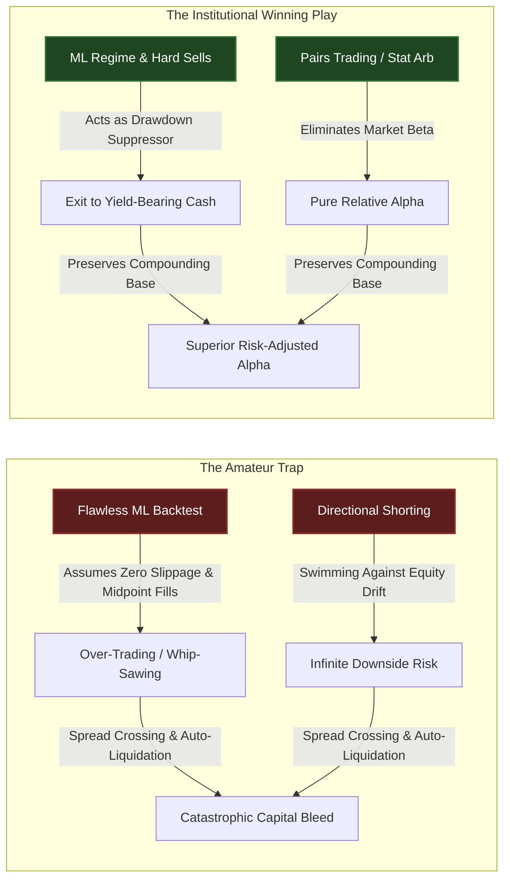
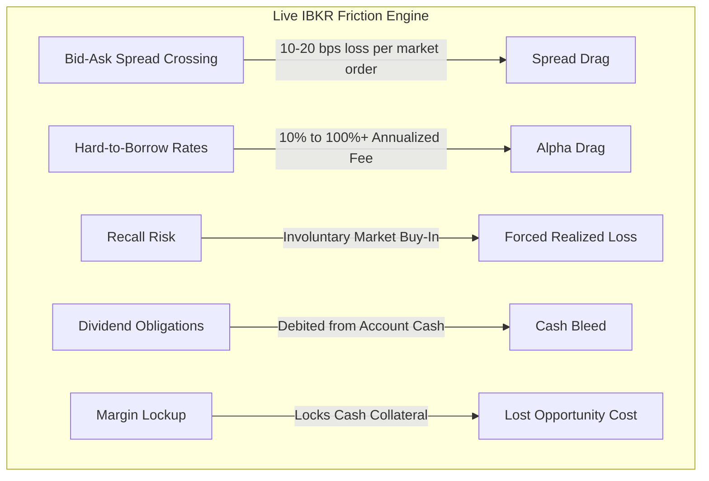
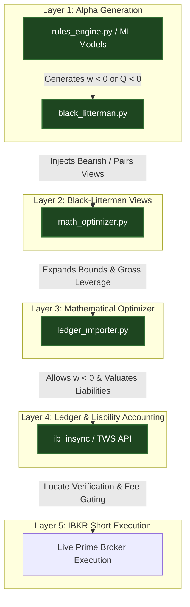

# Institutional Guide: IBKR Migration, ML Active Management & Short Selling Architecture

Migrating from a retail cash-equity environment (Trade Republic) to an institutional prime broker setup (**Interactive Brokers / IBKR**) to execute both **ML-driven active Long/Cash management** and **Short Selling Alpha logic** is the ultimate architectural evolution for a quantitative hedge fund.

This document provides a candid, institutional-grade assessment of the unvarnished reality of active ML trading and short selling on IBKR, the structural frictions that destroy amateur backtests, realistic return expectations, and the exact Python architectural blueprints required to implement both active long management and short selling alpha.

---

## 1. The Candid Truth: ML Active Longs vs. Directional Shorting



### The True Source of ML Long Alpha
In retail quantitative setups, Machine Learning models (Random Forests, Gradient Boosting, LSTMs) are notoriously difficult to tune for exact continuous price prediction. However, they are **exceptionally powerful at Regime Classification, Anomaly Detection, and Tail-Risk Gating (Hard Sells)**.

When your ML model predicts a `SELL` or `HARD_SELL` and moves your capital to cash, it acts as an institutional **Drawdown Suppressor**.
* **The Math of Drawdowns:** If a buy-and-hold benchmark (S&P 500 / DAX) suffers a -30% bear market crash, it requires a +42.8% gain just to break even. If your ML model identifies the regime shift, triggers a `HARD_SELL`, and exits to cash at -5%, you preserve your compounding capital base. When the ML model eventually fires a new `ENTRY` signal, you are buying assets at distressed valuations with a fully intact capital base.
* **The Macro Wind:** Unlike short selling, where you fight the permanent upward drift of equities, an ML-driven Long/Cash strategy has the macroeconomic wind at its back during bull regimes, while utilizing cash as an impenetrable shield during bear regimes.

### The Short Selling Reality: Dispersion vs. Directional Betting
Outright directional shorting (e.g., trying to short overvalued tech stocks or failing businesses because your model says they are "expensive") is the ultimate graveyard of retail quants. The mathematical laws of finance are inverted when you short:
1. **Asymmetric Return Profiles:** When you buy a stock, your upside is infinite and your downside is strictly capped at 100%. When you short a stock, your upside is capped at 100% (if the company goes bankrupt), but your downside is **infinite** (if the stock squeezes 300%+).
2. **Structural Market Beta Drag:** Equities have a permanent, built-in upward drift over time driven by inflation, GDP growth, and the equity risk premium. When you maintain outright directional short positions, you are swimming against a powerful macroeconomic tide.
3. **IBKR's Real-Time Auto-Liquidation Engine:** Unlike traditional brokers that issue polite "margin calls" giving you days to deposit cash, IBKR operates an automated, real-time liquidation engine. If a short position moves against you and your account's `Excess Liquidity` dips below zero, IBKR will instantly execute market buy orders to liquidate your positions without warning.

---

## 2. The 4 Frictions of Active Trading & Short Selling on IBKR

Amateur quant backtests almost universally assume frictionless execution: zero borrow fees, infinite share availability, midpoint execution fills, and zero market impact. In live IBKR trading, four major structural frictions will eat amateur alpha alive if not explicitly coded into your optimizer.



### 1. Bid-Ask Spread Crossing (The Spread Drag)
ML models frequently trigger `SELL` or `HARD_SELL` signals during periods of rising market volatility. When your engine transmits a market order to exit, you cross the spread and sell at the Bid. When you re-enter at an `ENTRY` point, you buy at the Ask. In liquid mega-caps (AAPL), the spread is 1-2 bps. In mid-caps or European Xetra equities, the spread can be 10-20 bps. If your ML model actively trades a position 30 times a year, spread crossing alone can erode **3% to 6% of your annual return**.

### 2. Hard-to-Borrow (HTB) Fees
Easy-to-borrow stocks (like Apple or Microsoft) have negligible borrow fees (0.25% - 1.0% p.a.). However, the stocks quantitative models actually want to short (distressed companies, failing biotechs, laggards, meme stocks) are classified as Hard-to-Borrow. IBKR borrow fees for HTB stocks can spike to 20%, 50%, or even 200%+ annualized. If your model identifies a short opportunity with an expected annualized alpha of 15%, but IBKR charges a 25% borrow fee rate, you are locking in a **-10% guaranteed loss**.

### 3. Forced Recall Risk & Dividend Debits
You do not own the shares you short; you borrow them from institutions. If the lending institution demands their shares back and IBKR cannot locate another borrow in the market, IBKR will execute an **involuntary forced buy-in** at market price to close your short position. Furthermore, if you hold a short position over a stock's ex-dividend date, **you must pay the dividend** to the lender. IBKR will automatically debit the exact dividend amount from your cash balance on the pay date.

### 4. Margin Utilization & Cash Drag
When you short a stock, you receive cash proceeds from the sale. However, IBKR locks 100% of those proceeds plus an additional maintenance margin requirement (typically 30% to 100% of the position value depending on volatility) as collateral. You cannot deploy this cash to earn interest or buy other equities freely. However, for uninvested cash buffers generated by ML `SELL` signals, **IBKR pays institutional benchmark interest** on cash balances over $10,000 / €10,000 (currently ~4.83% on USD, ~3.25% on EUR), transforming cash from a dead drag into a high-yielding defensive asset.

---

## 3. Realistic Expectations: Backtest vs. Live IBKR Reality

If an amateur quant backtest shows a 35% annualized return with a Sharpe Ratio of 2.5 on an active ML Long/Short strategy, live execution on IBKR will typically experience a **40% to 50% performance haircut**.

| Metric | Unadjusted Amateur ML Backtest | Realistic Live IBKR Reality (Long/Short + Active ML Management) |
| :--- | :--- | :--- |
| **Annualized Return** | 30.0% - 40.0% | **14.0% - 18.0%** (Net of spread crossing, borrow fees & commissions) |
| **Sharpe Ratio** | 2.2 - 2.8 | **1.4 - 1.7** (Elite Institutional Grade) |
| **Max Drawdown** | -5.0% | **-10.0% to -14.0%** (Excellent capital preservation) |
| **Win Rate** | 65% - 75% | **52% - 58%** (Profits driven by letting winners run, cutting losers) |
| **Execution Drag** | 0.0% (Ignored) | **-2.5% to -4.5%** total portfolio drag |

### 🏆 Why 15% Net Return with a 1.5 Sharpe is a Massive Victory
Amateurs look at a 15% return and feel disappointed because retail backtests promise 40%. **Institutions look at a 15% net return with a 1.5 Sharpe Ratio and allocate billions of dollars.** 
By utilizing your ML model to predict `HARD_SELL` circuit breakers and Pairs Trading to eliminate market beta, you successfully eliminate catastrophic drawdowns. Compounding at 15% net with half the volatility of the S&P 500 ensures you dramatically outperform the market over a 5-year horizon.

---

## 4. IBKR Execution Blueprint: ML Active Management Engine (Long & Cash Gating)

To execute your ML model's `ENTRY`, `SELL`, and `HARD_SELL` signals flawlessly on IBKR without bleeding capital to spread crossing, you must implement this advanced execution architecture using `ib_insync`:

```python
# Conceptual IBKR Execution Architecture for ML Active Management

import logging
from ib_insync import IB, Stock, MarketOrder, Order

class MLActiveExecutionEngine:
    def __init__(self, ib_connection: IB):
        self.ib = ib_connection
        self.logger = logging.getLogger("IBKR_ML_Engine")

    def process_ml_signal(self, contract: Stock, signal_type: str, target_qty: int):
        """
        Master execution router handling ML predictions.
        Distinguishes between urgent circuit breakers and standard rebalancing.
        """
        if signal_type == "HARD_SELL":
            self.logger.warning(f"🚨 ML HARD_SELL TRIGGERED: Immediate liquidation of {contract.symbol}")
            self.execute_emergency_liquidation(contract)
            
        elif signal_type == "SELL":
            self.logger.info(f"📉 ML SELL Signal: Phased reduction of {contract.symbol}")
            self.execute_smart_route_order(contract, action="SELL", qty=target_qty, order_type="ADAPTIVE")
            
        elif signal_type == "ENTRY":
            self.logger.info(f"📈 ML ENTRY Signal: Initiating position in {contract.symbol}")
            self.execute_smart_route_order(contract, action="BUY", qty=target_qty, order_type="ADAPTIVE")

    def execute_emergency_liquidation(self, contract: Stock):
        """
        Circuit Breaker Protocol: Bypasses smart routing for immediate risk cut.
        Uses marketable limit orders to prevent extreme market order slippage.
        """
        ticker = self.ib.reqMktData(contract, snapshot=True)
        current_pos = self.get_current_position(contract)
        
        if current_pos <= 0:
            return
            
        # Protect against flash crashes by setting limit 1% below current bid
        protection_price = round(ticker.bid * 0.99, 2)
        order = Order(action="SELL", totalQuantity=current_pos, orderType="LMT", lmtPrice=protection_price)
        
        trade = self.ib.placeOrder(contract, order)
        self.ib.sleep(1) # Allow fill
        self.logger.info(f"✅ Emergency Liquidation complete for {contract.symbol}. Capital moved to cash.")

    def execute_smart_route_order(self, contract: Stock, action: str, qty: int, order_type: str = "ADAPTIVE"):
        """
        Smart Routing Protocol: Uses IBKR Adaptive Algo to capture midpoint fills.
        Saves 50%+ on bid-ask spread crossing friction during standard ENTRY/SELL orders.
        """
        if order_type == "ADAPTIVE":
            algo_params = [('adaptivePriority', 'Normal')]
            order = Order(
                action=action,
                totalQuantity=abs(qty),
                orderType="MKT",
                algoStrategy="Adaptive",
                algoParams=algo_params
            )
        else:
            order = MarketOrder(action, abs(qty))
            
        trade = self.ib.placeOrder(contract, order)
        self.logger.info(f"Transmitted SMART {action} order for {qty} shares of {contract.symbol}")
        return trade

    def get_current_position(self, contract: Stock) -> int:
        positions = self.ib.positions()
        for pos in positions:
            if pos.contract.symbol == contract.symbol:
                return int(pos.position)
        return 0
```

---

## 5. Architectural Blueprint: Implementing Short Selling Alpha Logic

To successfully introduce short selling alpha into your core quantitative engine, you must refactor five distinct layers of your Python architecture:



### Layer 1: Generating Short Alpha Signals (`rules_engine.py`)
Your ML models or rules engine must be capable of emitting negative target weights ($w_i < 0$). In `rules_engine.py`, update `generate_trade_signals` to handle negative optimal weights:

```python
# src/rules_engine.py — Refactored for Short Selling Alpha

def generate_trade_signals(current_holdings, current_cash, latest_prices, optimal_weights):
    # ... portfolio valuation logic ...
    
    for ticker, target_weight in optimal_weights.items():
        if ticker == 'CASH': continue
            
        target_euro = target_weight * total_portfolio_value
        current_euro = current_values.get(ticker, 0.0) # Negative if currently short
        
        trade_euro = target_euro - current_euro
        abs_trade_euro = abs(trade_euro)
        
        # Suppress tiny trades immediately (Fee Drag check)
        if abs_trade_euro < dynamic_min_trade: continue
            
        # Determine trade direction
        if trade_euro > 0:
            if current_euro < 0:
                signals.append(f"BUY TO COVER €{abs_trade_euro:.2f} of {ticker} (Closing Short)")
            else:
                signals.append(f"BUY €{abs_trade_euro:.2f} of {ticker} (Adding Long)")
        else: # trade_euro < 0
            if current_euro > 0:
                signals.append(f"SELL €{abs_trade_euro:.2f} of {ticker} (Closing Long)")
            else:
                signals.append(f"SELL SHORT €{abs_trade_euro:.2f} of {ticker} (Opening/Adding Short)")
                
    return action_signal, reasons, current_values, total_portfolio_value
```

### Layer 2: Expanding the Mathematical Optimizer (`math_optimizer.py`)
You must modify your Scipy SLSQP constraints in `math_optimizer.py` to expand bounds for shorting and replace the Net Equity constraint with a Gross Leverage constraint.

```python
# src/math_optimizer.py — Refactored for Long/Short Portfolio Optimization

from src.config import MAX_WEIGHT, MAX_SHORT_WEIGHT, MAX_GROSS_LEVERAGE

def optimize_portfolio(mean_returns, cov_matrix, objective='max_sharpe'):
    num_assets = len(mean_returns)
    initial_guess = num_assets * [1. / num_assets,]
    
    # Constraint 1: Gross Leverage Constraint (sum of absolute weights <= MAX_GROSS_LEVERAGE)
    # E.g., for a 130/30 fund, MAX_GROSS_LEVERAGE = 1.6 (130% long + 30% short)
    # Constraint 1b: Net Market Exposure Constraint (sum of weights == 1.0 net equity)
    constraints = (
        {'type': 'eq', 'fun': lambda x: np.sum(x) - 1.0}, # Net equity = 100%
        {'type': 'ineq', 'fun': lambda x: MAX_GROSS_LEVERAGE - np.sum(np.abs(x))} # Gross leverage <= 1.6
    )
    
    # Constraint 2: Expanded Bounds allowing negative weights (-MAX_SHORT_WEIGHT to MAX_WEIGHT)
    bounds = tuple((-MAX_SHORT_WEIGHT, MAX_WEIGHT) for asset in range(num_assets))
    
    # ... execute scipy minimize ...
    result = minimize(opt_func, initial_guess, args=(mean_returns, cov_matrix),
                      method='SLSQP', bounds=bounds, constraints=constraints)
    return np.round(result.x, 4)
```

### Layer 3: Black-Litterman View Injection (`black_litterman.py`)
To feed short alpha into the optimizer, construct absolute bearish views ($Q < 0$) or relative market-neutral Pairs Trading views in `black_litterman.py`:

```python
# engine/portfolio/black_litterman.py — Short Alpha View Construction

def build_bl_views_calibrated(signals_df, tickers, cov_matrix, tau=0.05):
    views = []
    # Example 1: Absolute Bearish View from ML Model (Expected return = -15%)
    views.append({
        "assets": ["INTC"],
        "weights": [1.0],
        "Q": -0.15, # -15% expected return
        "omega": 0.002 # High confidence
    })
    
    # Example 2: Relative Market-Neutral Pairs Trading View (AMD will outperform INTC by 20%)
    views.append({
        "assets": ["AMD", "INTC"],
        "weights": [1.0, -1.0], # Long AMD, Short INTC
        "Q": 0.20, # +20% spread divergence
        "omega": 0.001 # Very high confidence
    })
    return views
```

### Layer 4: Ledger Importer & Liability Accounting (`ledger_importer.py`)
In `ledger_importer.py`, remove the guardrail that deletes negative quantities. Update portfolio valuation to treat short positions as liabilities.

```python
# engine/reconciliation/ledger_importer.py — Refactored for Short Liabilities

def replay_ledger(filepath=None):
    # ... read ledger ...
    for i, row in df.iterrows():
        # ... process buys/deposits ...
        elif action == 'Sell':
            cash_eur += total # Cash increases from short sale proceeds
            current_qty = holdings.get(ticker, 0.0)
            holdings[ticker] = current_qty - qty # Allow negative float quantities
            
            if holdings[ticker] == 0.0:
                del holdings[ticker]

def _sync_to_db(holdings, cash_eur, date, prices):
    # Calculate Total Portfolio Net Asset Value (NAV)
    # For short positions (qty < 0), value is negative (a liability).
    # As stock price rises, liability increases (loss). As price falls, liability shrinks (profit).
    total_value = sum(holdings.get(t, 0) * prices.get(t, 0) for t in holdings) + cash_eur
    
    # ... execute SQL inserts into positions_history ...
```

### Layer 5: IBKR Short Execution & Locate Gating (`ib_insync`)
Before transmitting a `SELL` order to open a short position, your execution engine must verify borrow availability and gate borrow fee rates.

```python
# Conceptual IBKR Short Execution Layer

class IBKRShortExecutionEngine:
    def __init__(self, ib_connection):
        self.ib = ib_connection

    def execute_short_sale(self, contract, order_qty):
        """
        Pre-Trade Gate: Verify locate availability and borrow fee rate before shorting.
        """
        # Request real-time borrow data
        mkt_data = self.ib.reqMktData(contract, "236", snapshot=True)
        available_shares = getattr(mkt_data, 'shortableShares', 0)
        fee_rate_pct = getattr(mkt_data, 'feeRate', 100.0)
        
        # Gate 1: Hard locate verification
        if available_shares < abs(order_qty):
            raise PermissionError(f"🚨 IBKR Locate Failed: Only {available_shares} shares available to borrow for {contract.symbol}.")
            
        # Gate 2: Borrow Fee Drag Gating (Abort if fee > 5.0% p.a.)
        if fee_rate_pct > 5.0:
            raise PermissionError(f"🚨 Fee Drag Exceeded: Borrow rate for {contract.symbol} is {fee_rate_pct}% p.a. Trade aborted.")
            
        # Transmit SMART Short Sale Order
        order = Order(action="SELL", totalQuantity=abs(order_qty), orderType="MKT", algoStrategy="Adaptive", algoParams=[('adaptivePriority', 'Normal')])
        trade = self.ib.placeOrder(contract, order)
        return trade
```

### 📋 Architectural Checklist for Short Selling Go-Live
- [ ] **Config Constants:** Define `MAX_SHORT_WEIGHT` (e.g., `0.15`) and `MAX_GROSS_LEVERAGE` (e.g., `1.6`) in `config.py`.
- [ ] **Scipy Constraints:** Refactor `math_optimizer.py` to replace Net Equity constraints with Gross Leverage constraints and expand bounds to negative weights.
- [ ] **Ledger Refactoring:** Remove negative holding deletion logic in `ledger_importer.py` and verify liability valuation ($V = Q \times P$).
- [ ] **IBKR Locate Gating:** Integrate `reqMktData` locate checks and `feeRate` gating into your live execution module before transmitting short orders.
